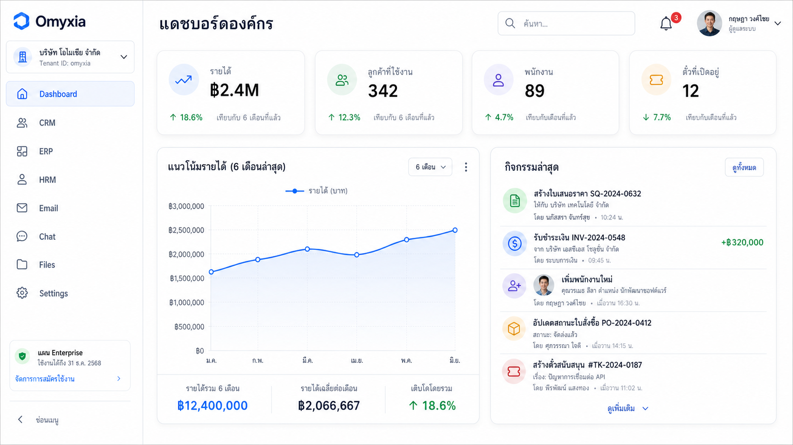
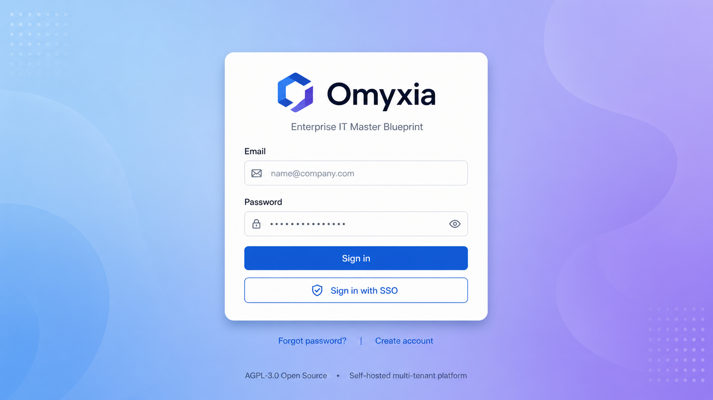
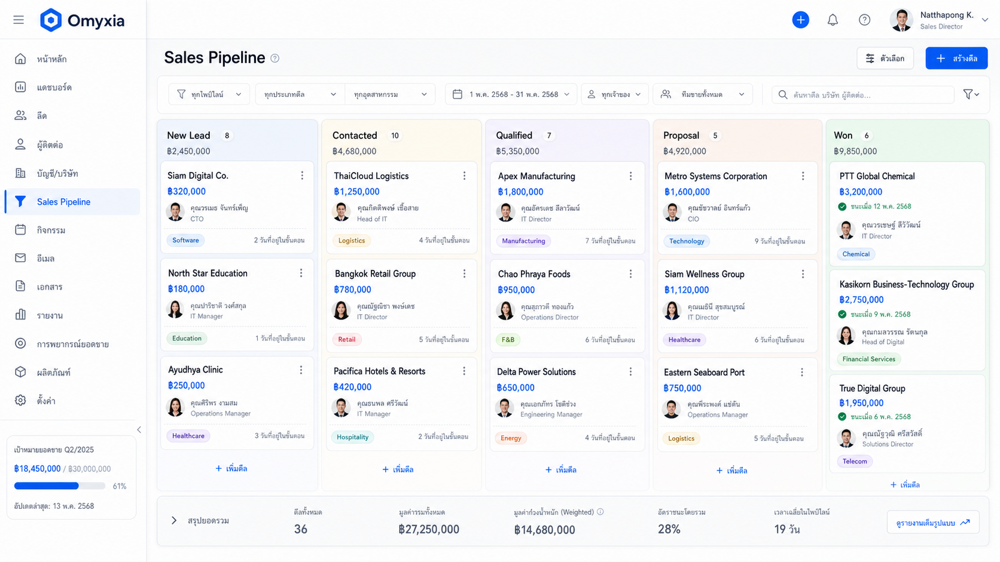
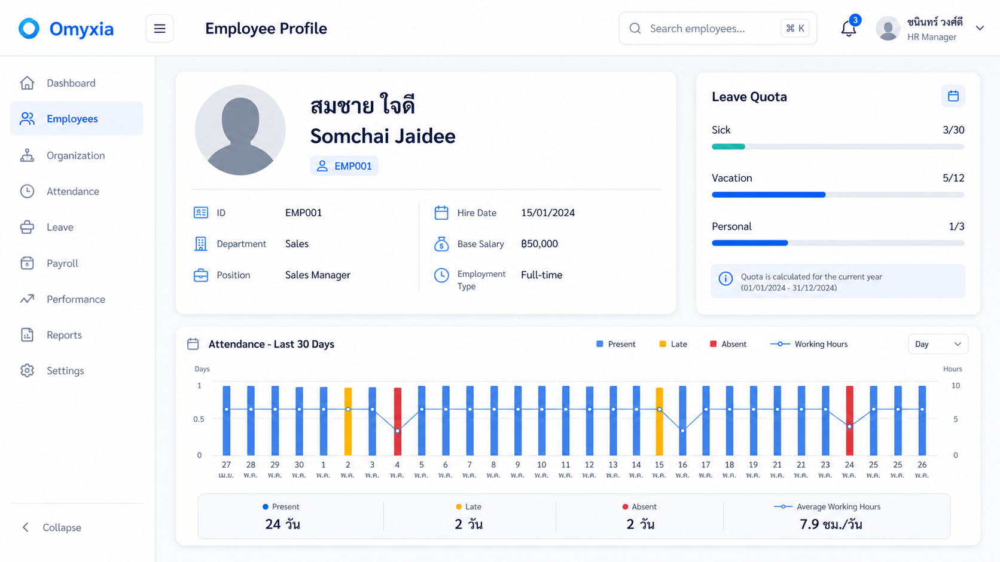

<div align="center">

# 🏛️ Omyxia

### Open-source multi-tenant Enterprise IT Master Blueprint — 14 systems in one self-hostable SaaS

[]()
[]()
[]()
[]()

Omyxia is a production-hardened blueprint for running ERP, HRM, CRM, workspace, analytics, compliance, and tenant operations from one self-hosted codebase.
It gives engineering teams a serious AGPL-3.0 starting point for multi-tenant SaaS: PostgreSQL RLS, RBAC, MFA, audit logging, exports, Helm, and Docker-first local setup.

[Quick Start](#quick-start) ·
[What you get](#what-you-get) ·
[Architecture](#how-it-fits-together) ·
[Security](#battle-tested-for-production) ·
[Contributing](#contributing)

</div>

---

<p align="center">
  
</p>

<p align="center">
  <em>Multi-tenant BI dashboard — KPIs, revenue trend, activity feed — Thai-first by design.</em>
</p>

---

## Screenshots

<table align="center">
  <tr>
    <td align="center" width="50%">
      <br>
      <sub><b>Login & SSO</b></sub>
    </td>
    <td align="center" width="50%">
      <br>
      <sub><b>CRM Pipeline (Kanban)</b></sub>
    </td>
  </tr>
  <tr>
    <td align="center" colspan="2">
      <br>
      <sub><b>HRM Employee Profile (Thai + English, ฿ salary, leave quotas, attendance)</b></sub>
    </td>
  </tr>
</table>

---

## The $50k/month SaaS problem

Growing companies often pay for the same enterprise foundations many times over: users, roles, tenant boundaries, audit logs, exports, notifications, dashboards, files, workflows, and integrations.

Commonly separate subscriptions include:

- ERP: SAP B1, Oracle NetSuite, Odoo
- HRM: Workday, BambooHR
- CRM: Salesforce, HubSpot
- Email and shared inboxes: Google Workspace, Front
- Chat: Slack, Microsoft Teams
- File share: Dropbox, Google Drive
- IAM: Okta, Auth0
- BI dashboard: Tableau, Looker
- WMS: NetSuite WMS
- SRM: SAP Ariba
- PMS and DMS: Asana, Confluence
- FMS: Fleetio
- ITSM: Jira Service Management
- Risk, compliance, and PDPA: OneTrust, RSA

Omyxia is the OSS master blueprint that replaces all of these with one multi-tenant, self-hostable SaaS foundation.

### What Omyxia replaces

| Domain | Replaces | Status |
|---|---|---|
| ERP | SAP B1, Oracle NetSuite, Odoo | ✅ Shipped: GL, AP, AR, Tax, COA |
| HRM | Workday, BambooHR | ✅ Shipped: Employee, Leave, Payroll, Attendance |
| CRM | Salesforce, HubSpot | ✅ Shipped: Pipeline, Lead, Activity |
| Email | Google Workspace, Front | ✅ Shipped: IMAP/SMTP via Stalwart |
| Chat | Slack, Teams | ✅ Shipped: Channels, messages, realtime gateway |
| File Share | Dropbox, Google Drive | ✅ Shipped: Folders, versioning, MinIO storage |
| IAM | Okta, Auth0 | ✅ Shipped: JWT, RBAC, tenant lifecycle, MFA |
| BI Dashboard | Tableau, Looker | ✅ Shipped: KPIs, snapshots, exports, scheduled reports |
| WMS | NetSuite WMS | ✅ Shipped: Inventory and movements |
| SRM | SAP Ariba | ✅ Shipped: Vendor scoring |
| PMS / DMS | Asana, Confluence | ✅ Shipped: Projects and documents foundation |
| FMS | Fleetio | ✅ Shipped: Vehicle trips |
| ITSM | Jira Service Management | ✅ Shipped: Tickets |
| FRM / CMP / PDPA | OneTrust, RSA | ✅ Shipped: Risk and compliance |

---

## What you get

### Auth & Tenant

- ✅ Multi-tenant signup, onboarding, tenant switching, and tenant-scoped middleware.
- ✅ JWT issuance and refresh tokens with explicit algorithm and audience.
- ✅ RBAC permissions matrix for Owner, Admin, Member, and Viewer roles.
- ✅ TOTP MFA enrollment with bcrypt-hashed, one-time-use recovery codes.

### Workspace

- ✅ Email integration through Stalwart IMAP/SMTP.
- ✅ Realtime chat over Socket.IO/WebSocket gateways.
- ✅ File upload, presigned object access, folders, and MinIO storage.
- ✅ Project, document, ticket, and activity foundations across tenant-scoped modules.

### Analytics

- ✅ BI dashboard backend for KPIs, dashboard records, and persisted snapshots.
- ✅ Dashboard frontend surface for listing and viewing tenant dashboards.
- ✅ CSV export with RFC-4180 escaping; XLSX and PDF extension points.
- ✅ Scheduled reports service with tenant-scoped create, list, cancel, and run logic.

### Production

- ✅ PostgreSQL Row-Level Security plus Prisma tenant scoping.
- ✅ Audit log middleware for mutating requests.
- ✅ Docker Compose, production self-hosting docs, and Helm chart.
- ✅ k6 benchmark target: p95 < 200ms.
- ⏳ v1.1.0 hardening backlog: auth rate limits, Dependabot config, token revocation list, and audit log streaming.

---

## 100% open-source stack

| Concern | Choice |
|---|---|
| Backend | NestJS 10 + Prisma 5 + PostgreSQL 16 + Redis 7 + Socket.IO 4 + MinIO |
| Frontend | Next.js 15 + React 19 + Tailwind + shadcn |
| Infra | Docker Compose + Helm chart + k6 benchmarks |
| Auth | JWT + TOTP MFA + bcrypt 12 rounds |
| Email Server | Stalwart Mail Server |
| Observability | Grafana OSS + Loki + Prometheus + Tempo |
| Testing | Vitest + Playwright + supertest |
| Monorepo | pnpm workspaces + Turborepo |

---

## Quick Start

### Prerequisites

- **Node.js** ≥ 20.0.0
- **pnpm** ≥ 10.0.0
- **Docker** (for Postgres + Redis + MinIO + Stalwart)

### 5-Minute Setup

```bash
# 1. Clone & install
git clone https://github.com/open-uppu/omyxia.git
cd omyxia
pnpm install

# 2. Configure environment
cp .env.example .env
# Edit .env if needed (defaults work for local dev)

# 3. Start infrastructure (Postgres + Redis + MinIO + Stalwart)
sg docker -c 'docker compose -f infra/docker-compose.yml up -d'

# 4. Run database migrations
pnpm db:migrate

# 5. Seed demo tenant ("acme-th-demo" with Thai defaults)
pnpm db:seed

# 6. Start dev servers (API on :3001, Web on :3000)
pnpm dev
```

### Default Seeded Credentials

```
Tenant:  acme-th-demo
Email:   admin@acme-th.demo
Password: demo123!
```

> Includes: 12 chart of accounts, 5 Thai tax rates (VAT 7%, WHT 1/2/3/5%), 1 customer, 1 vendor, 1 employee.

---

## How it fits together

Tenant isolation is enforced at the request, service, ORM, and database layers.

```text
+------------------+     +-----------------------+     +--------------------------+
| Browser / Client | --> | API Gateway / NestJS  | --> | Tenant-scoped modules   |
| tenant in JWT    |     | JWT + RBAC + ALS      |     | ERP HRM CRM BI Files    |
+------------------+     +-----------------------+     +--------------------------+
                                 |                                  |
                                 | tenant context                  | tenantId whitelist
                                 v                                  v
                         +----------------+        +-------------------------------+
                         | Redis 7        |        | PostgreSQL 16 + Prisma 5     |
                         | queues/cache   |        | RLS policies per tenant      |
                         +----------------+        +-------------------------------+
                                 |
                                 v
                         +----------------+
                         | MinIO / S3     |
                         | tenant paths   |
                         +----------------+
```

### Blueprint layers

```
┌─────────────────────────────────────────────────────────┐
│  Layer 7: BI Dashboard         (KPIs, Reports, BI)      │  ← Insights
├─────────────────────────────────────────────────────────┤
│  Layer 6: Workspace            (Email + Chat + Files)   │  ← Collaboration
├─────────────────────────────────────────────────────────┤
│  Layer 5: Core Pillars         (CRM · ERP · HRM)        │  ← Business Logic
│            + Specialized        (MAS · PMS · WMS · …)    │
├─────────────────────────────────────────────────────────┤
│  Layer 4: Cross-cutting        (FMS · CMP/PDPA)         │  ← Governance
├─────────────────────────────────────────────────────────┤
│  Layer 1: Infra & Security     (IAM · Endpoint · Backup │
│                                 + Multi-tenant RLS)     │  ← Foundation
└─────────────────────────────────────────────────────────┘
```

### Repository Layout

```
omyxia/
├── apps/
│   ├── api/                      # NestJS 10 backend
│   │   ├── src/
│   │   │   ├── modules/          # 13 business modules (crm, erp, hr, …)
│   │   │   │   ├── crm/          # CRM service + spec
│   │   │   │   ├── erp/          # ERP service + spec
│   │   │   │   └── …
│   │   │   └── common/           # Prisma + tenant-context middleware
│   │   ├── test/
│   │   │   ├── e2e/              # E2E smoke tests
│   │   │   └── integration/      # DB schema-drift guard
│   │   └── vitest.{,e2e.,integration.}config.ts
│   └── web/                      # Next.js 15 frontend (scaffold)
│
├── packages/
│   └── shared-types/             # Zod schemas + TS types
│
├── prisma/
│   ├── schema.prisma             # 64 models, RLS-aware
│   ├── migrations/               # 5 incremental migrations
│   └── seed.ts                   # Demo tenant seed
│
├── infra/
│   └── docker-compose.yml        # Postgres + Redis + MinIO + Stalwart
│
├── docs/
│   └── adr/                      # Architecture Decision Records
│
├── turbo.json                    # Turborepo pipeline
├── pnpm-workspace.yaml
└── package.json
```

---

## Battle-tested for production

Security is designed as defense in depth, with application checks backed by database isolation:

- ✅ bcrypt 12 rounds.
- ✅ JWT with explicit algorithm and audience.
- ✅ RBAC matrix with role-gated endpoints.
- ✅ MFA TOTP plus bcrypt-hashed recovery codes.
- ✅ Audit log middleware for `POST`, `PUT`, `PATCH`, and `DELETE`.
- ✅ Tenant scoping via AsyncLocalStorage plus PostgreSQL Row-Level Security.
- ✅ RFC-4180 CSV escaping for exports.
- ✅ Sandboxed iframe for template rendering.
- ✅ Field whitelisting in services so request bodies cannot overwrite `tenantId`.
- ✅ RTO 4h / RPO 1h / p95 < 200ms target.

### Multi-tenant security model

```
┌──────────────────────────────────────────────────────────┐
│  Layer 3: Application       (TenantContext middleware)   │
│            └─ injects tenantId from JWT into every query │
├──────────────────────────────────────────────────────────┤
│  Layer 2: ORM                (Prisma WHERE tenantId)     │
│            └─ every query auto-scoped to current tenant │
├──────────────────────────────────────────────────────────┤
│  Layer 1: Database           (PostgreSQL RLS)            │
│            └─ current_tenant_id() function + policies    │
└──────────────────────────────────────────────────────────┘
```

### Key properties

- ✅ **Every** domain entity has `tenantId` column.
- ✅ **Every** tenant-scoped table has `ENABLE ROW LEVEL SECURITY` plus policy.
- ✅ **Integration test** (`test/integration/schema-drift.integration-spec.ts`) verifies RLS is enabled.
- ✅ **Tenant context** set via `SET app.current_tenant = '<id>'`.
- ✅ **Cross-tenant access = P0 incident** with loud failure, not silent leakage.

Read more in [docs/security/ATTACK_SURFACE.md](docs/security/ATTACK_SURFACE.md), [docs/security/RBAC_MATRIX.md](docs/security/RBAC_MATRIX.md), and [docs/runbooks/DISASTER_RECOVERY.md](docs/runbooks/DISASTER_RECOVERY.md).

### Testing Strategy

Omyxia uses a 3-tier testing pyramid:

```
                    ▲
                   ╱ ╲
                  ╱   ╲         E2E (smoke)
                 ╱─────╲        vitest.e2e.config.ts
                ╱       ╲       boots NestJS modules
               ╱─────────╲
              ╱           ╲     Integration (DB guard)
             ╱             ╲    vitest.integration.config.ts
            ╱───────────────╲   verifies DB ↔ schema sync
           ╱                 ╲
          ╱                   ╲  Unit (mocked Prisma)
         ╱                     ╲ vitest (default)
        ╱_______________________╲
```

#### Commands

| Command | What it does |
|---|---|
| `pnpm test` | Backend tests (291 backend tests passing) |
| `pnpm test:e2e` | E2E smoke tests (boots NestJS) |
| `pnpm --filter @omyxia/api test:integration` | DB integration guard (requires Postgres) |
| `pnpm type-check` | TypeScript strict mode check |
| `pnpm lint` | ESLint (0 errors, 128 warnings) |
| `pnpm build` | Production build for all 3 packages |

#### Test stats

```
✅ Backend tests:    291 / 291 passing
✅ E2E tests:          1 / 1 passing (health smoke)
✅ Integration:        5 / 5 passing (DB ↔ schema sync)
✅ Type-check:         0 errors
✅ Build:              3 / 3 packages
✅ Lint:               0 errors
```

## Release status

| Release | Status | Date | Scope |
|---|---|---:|---|
| v1.0.0 Production Hardening | ✅ SHIPPED | 2026-06-29 | Security hardening, disaster recovery runbook, Helm chart, production docs, benchmark target |
| v0.4.0 Analytics & Insights | ✅ SHIPPED | 2026-06-29 | BI dashboards, snapshots, CSV export, scheduled reports |
| v0.3.x Workspace | ✅ SHIPPED | 2026-06-29 | Email, realtime chat, files, project and document foundations |
| v0.2.0 Auth & Tenant | ✅ SHIPPED | 2026-06-29 | JWT auth, tenant lifecycle, tenant switcher, RBAC, MFA, audit logs |
| v0.1.0 Foundation | ✅ SHIPPED | 2026-06-29 | Monorepo, Prisma schema, RLS migrations, modules, seed tenant |
| v1.1.0 Next | ⏳ PLANNED | TBD | Rate limit `/auth/login`, HSTS deployment verification, Dependabot, token revocation, audit log export |

---

## License

License: AGPL-3.0 — see [LICENSE](LICENSE).

This means:

- ✅ Use freely, including commercially.
- ✅ Modify and distribute.
- ✅ If you run a modified version as a network service, you must publish your source code.
- ✅ All derivative works must also be AGPL-3.0.

---

## Contributing

PRs welcome. See [CONTRIBUTING.md](CONTRIBUTING.md) for workflow.

Good first contribution areas:

- Bug reports with reproduction steps.
- Documentation improvements in `docs/`.
- Thai, Japanese, and other translations.
- Additional tests, especially tenant isolation and RLS coverage.
- UI improvements for the Next.js frontend.

### Development Workflow

```bash
# Fork & clone
git clone https://github.com/<you>/omyxia.git

# Create a feature branch
git checkout -b feat/my-feature

# Make changes + test
pnpm install
pnpm test
pnpm test:e2e
pnpm --filter @omyxia/api test:integration

# Commit with conventional commits
git commit -m "feat(crm): add lead scoring algorithm"

# Push & open PR
git push origin feat/my-feature
```

### Workboard Orchestration

Internal dev workflow uses OpenClaw Workboard plugin (v2026.6.10) for multi-agent task coordination.
Workers run autonomously and post PRs for human review.

---

## Need help?

- GitHub Issues: use [open-uppu/Omyxia issues](https://github.com/open-uppu/Omyxia/issues) for bugs and feature requests.
- Responsible disclosure: see [SECURITY.md](SECURITY.md).
- Self-hosting: see [docs/SELF-HOST.md](docs/SELF-HOST.md).
- Architecture records: see [docs/adr/](docs/adr/).
- Discussions: use [GitHub Discussions](https://github.com/open-uppu/omyxia/discussions) for design and roadmap topics.

---

## Built by [Open-Uppu](https://github.com/open-uppu)

Built by the Open-Uppu team for organizations that want to own, inspect, and operate their enterprise IT platform.
